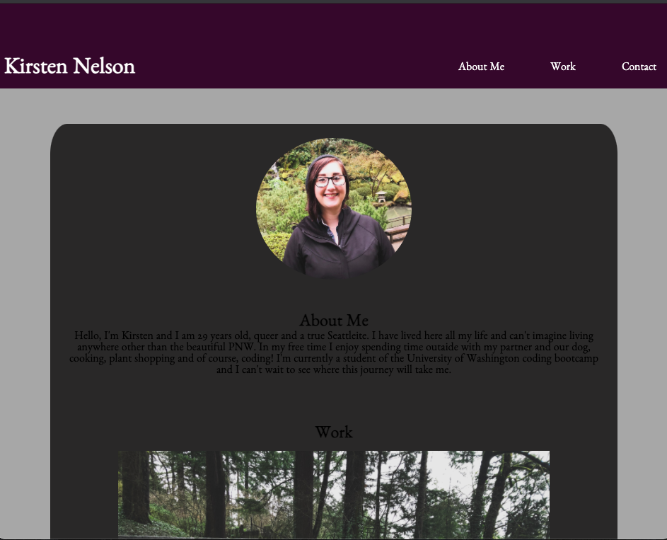
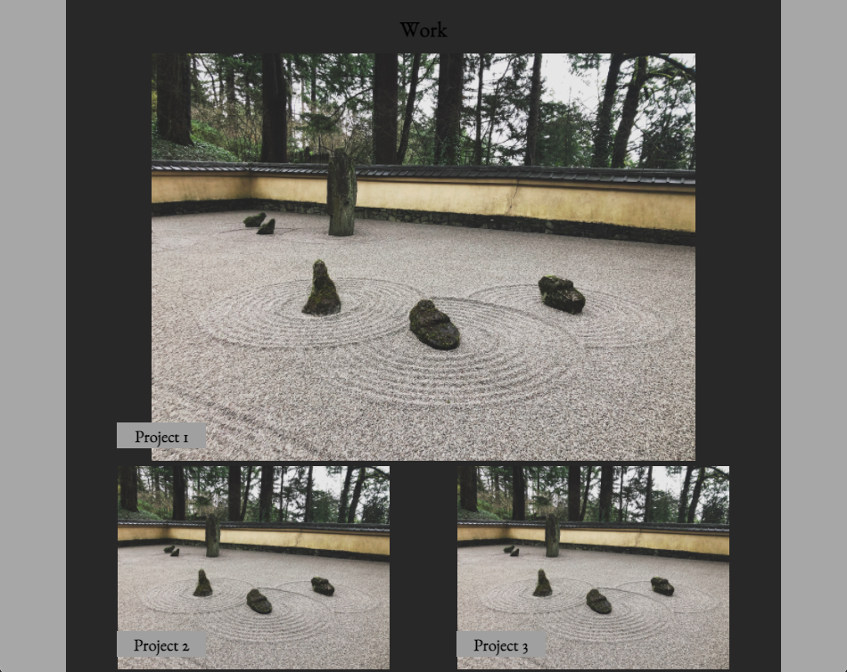
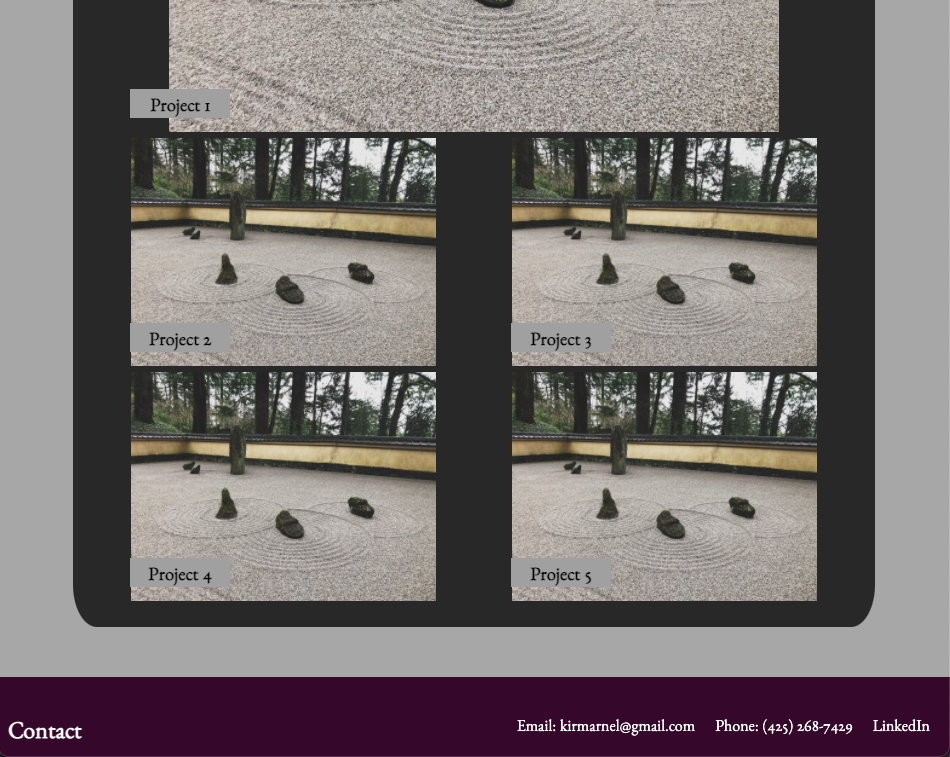

For this project I have made a portfolio that I will use to host future projects. Building this from scratch was definitely a challenge but it allowed me to learn a lot about html and css. Ultimately I am happy with how it turned out. I have used both flexbox and media queries to make my site responsive and look good on various screen sizes. Below I have included screen shots and a link to the finished product.

https://kirmarnel.github.io/portfolio/
